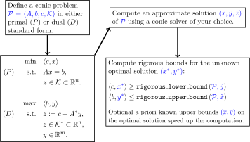

# VSDP <small>Verified SemiDefinite-quadratic-linear Programming</small>

VSDP is a software package for the computation of verified results in conic programming.
It supports the constraint cone consisting of the product of semidefinite cones,
second-order cones, and the non-negative orthant.
VSDP provides functions for computing rigorous error bounds of the true optimal value,
verified enclosures of epsilon-optimal  solutions, and verified certificates of infeasibility.
All rounding errors due to floating-point arithmetic are taken into account.

The software is completely written in [MATLAB](https://www.mathworks.com) /
[GNU Octave](https://www.gnu.org/software/octave) and requires the interval
toolbox [INTLAB](http://www.ti3.tuhh.de/rump/intlab).  Thus interval input is
supported as well.

The latest version of VSDP provides easy access to the
[conic solvers](s09_conic_solvers.html):
- [CSDP](https://github.com/coin-or/Csdp),
  [GLPK](https://www.gnu.org/software/glpk),
  [LINPROG](https://www.mathworks.com/help/optim/ug/linprog.html),
  [lp_solve](https://lpsolve.sourceforge.io),
  [MOSEK](https://www.mosek.com),
  [SDPA](https://sdpa.sourceforge.io),
  [SDPT3](https://github.com/sqlp/sdpt3), and
  [SeDuMi](https://github.com/sqlp/sedumi).

## Contents

- [Installation](s00_installation.html)
- [Conic Programming](s01_conic_programming.html)
  - [Linear Programming (LP)](s02_linear_programming.html)
  - [Second-order Cone Programming (SOCP)](s03_second_order_cone_programming.html)
  - [Semidefinite Programming (SDP)](s04_semidefinite_programming.html)
- [A priori bounds](s05_a_priori_bounds.html)
- [Certificates of infeasibility](s06_certificates_of_infeasibility.html)
- [Free variables](s07_free_variables.html)

Appendix

- [Numerical results](s08_numerical_results.html)
- [Conic solvers](s09_conic_solvers.html)
- [References](s10_references.html)

## Available VSDP versions

- The VSDP versions numbers reflect the release date:
  - [VSDP 2020](https://github.com/vsdp/vsdp-2020)
    - Improvements: solver support and detection, workflow, testing, and
      documentation.
  - [VSDP 2012](https://github.com/vsdp/vsdp-2012)
    - Improvements: additional support of second-order cones, linear cones, and
      free variables, vectorized internal structure.
      See [[Härter2012]](s10_references.html#Härter2012).
  - [VSDP 2006](https://github.com/vsdp/vsdp-2006)
    - Support for large scale semidefinite problems, comprehensible code.
      See [[Jansson2006]](s10_references.html#Jansson2006).

## Contributors

- [Christian Jansson](http://www.ti3.tuhh.de/jansson/) (<jansson@tuhh.de>)
- Marko Lange (<m.lange@tuhh.de>)
- Viktor Härter
- Kai Torben Ohlhus (<kai.ohlhus@tuhh.de>)
